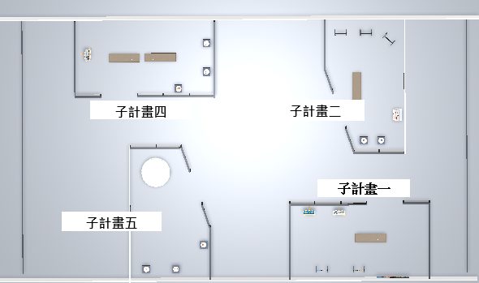

## directory structure

新版資料主要在 `Assets/Resources/` 下。

#### Resources 資料夾
```
Resources/
├─ Material/       # 材質  
├─ Model/          # 3D 模型  
├─ Pictures/       # 圖片資源  
│  ├─ Commodity/   # 商品圖片
│  └─ icon/  
├─ Prefabs/       # 窗戶、展架、欄杆等預製件
└─ Scripts/        # 新版新增的所有腳本  

```

#### 現有模型
- *畫架*：`Assets/PaintingSet/`  


## main functions of scripts under `Assets/Resources/Scripts/`
- **ExhibitInteraction.cs**：處理展品的互動邏輯。
- **ExitButton.cs**：退出程式的按鈕。
- **RaycastManager.cs**：負責射線檢測，判斷玩家點擊的物件。


## other
- **空間依商品類型劃分**
  - 子計畫一 : 水上活動
  - 子計畫二 : 海洋教育活動
  - 子計畫四 : 文創
  - 子計畫五 : 海藻商品  
  

- **操作說明**
  - 旋轉視角 : 滑鼠右鍵拖曳
  - 查看商品資訊 : 滑鼠左鍵點擊
  - 離開程式 : 點擊畫面右上角離開按鈕